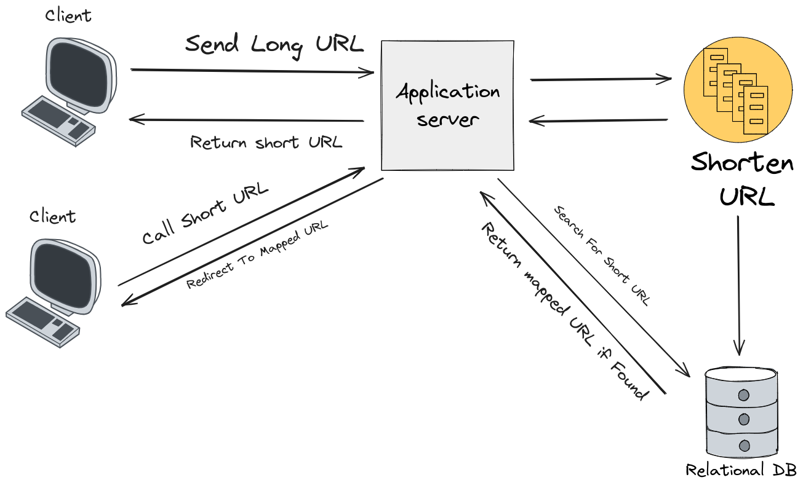
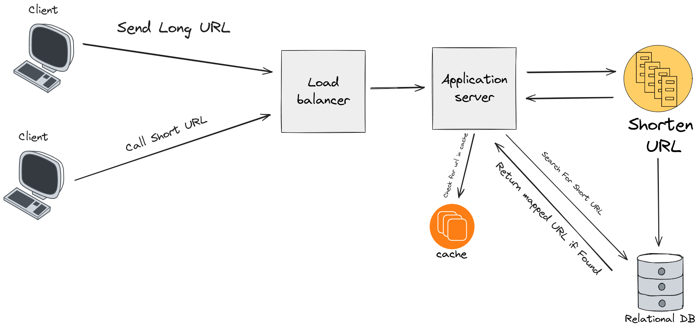

URL Shortener
---------------------

## Technologies & Language
- Golang
- Chi
- MYSQL DB

## Use Cases
- User Send URL to be Shortened
- User hits a shortened URL

## Constraints
*State Constraints*
- URL max length is 2048 Bytes 
- shortened URL should be less than or equal 75 bytes (average number for URL length)

# Design

# System Architecture
The system Consists of the following components
- API : Allow the users to interact with system 
- Server : Receives the requests from the API for shortnening and redirecting 
- Database: Store the short url coupled with the original one

## Design Core Components

#### Use Case: User sends a URL to be shortened
- The Client sends a Request to API with long URL to be shortened
- The server recevies the request and send the URL to backend
- Backend Shorten the URL and store the short URL coupled with original in the database
  - URL Shortener function:
    - Check if the shortened URL collides with another in database
- The Server then Returns the shortened URL to the client

#### Use Case : User Hits a shortened URL
- The Client send a request to shortened URL
- The server Receives the request and search the database for the original URL
- The Database Returns the original URL if it exisits 
- The server then redirect the client to original URL

## Scale The Design

To Scale our Design we need it to handle high load efficiently, so we add load balancer to divide the requests
handle concurrent workers, also for faster reads we add caching layer to avoid database lookups for frequently
called URLs