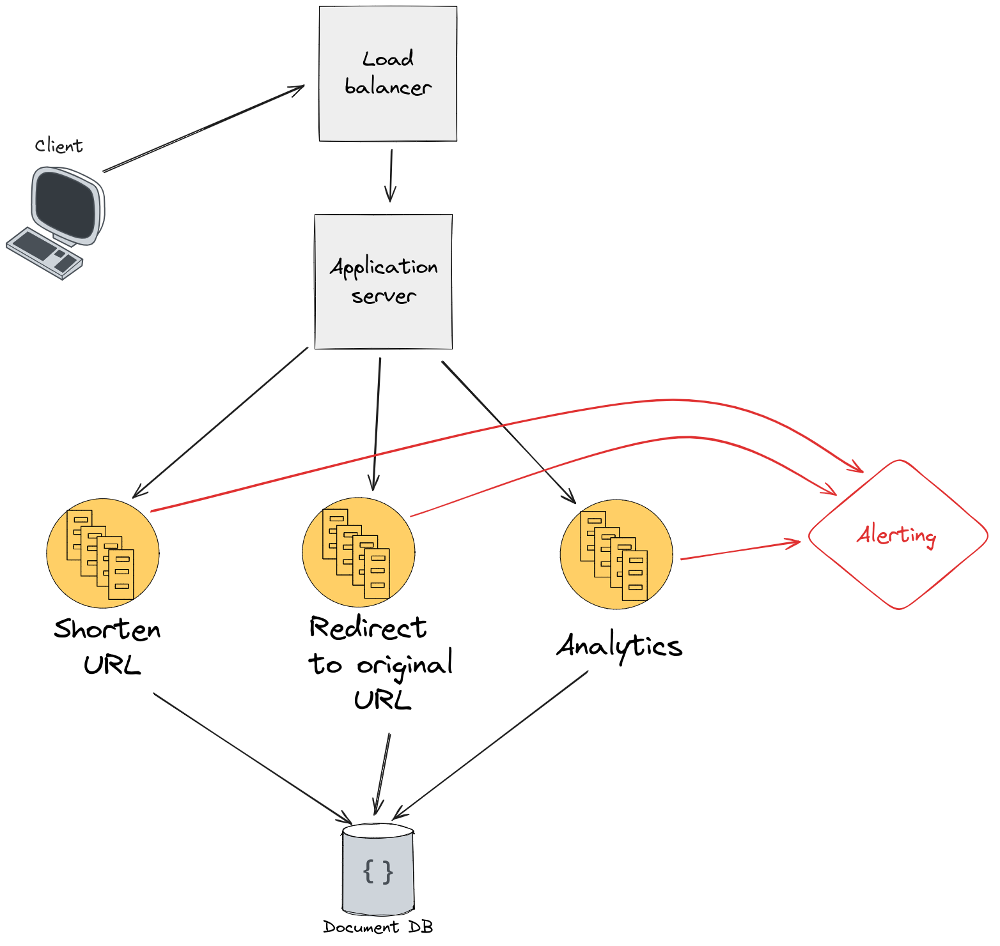
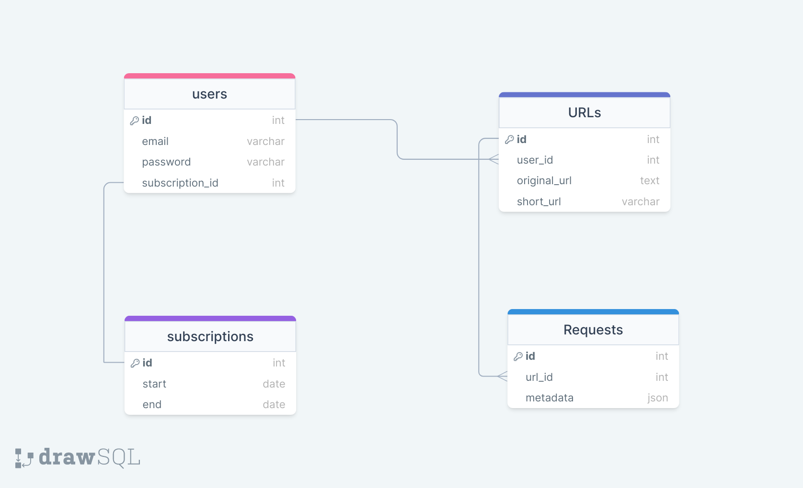

URL Shortener
---------------------

## Technologies & Language
- Golang
- Chi
- Mysql
- Pub Sub system

## Use Cases
- User Send URL to be Shortened
- User hits a shortened URL
- User wants to see metrics for his url

## Constraints & Assumptions
*State Assumptions*

The App is expected to have 100M requests per month
so the average per day is around 3.3M and 40 request per Second.

- 100M requests per month

    - Anticipating a high volume of requests (3.3M per day, 40 per second).
    - System needs to handle this load efficiently.

- Read-to-write ratio of 10:1

  - Multiple reads for each URL created.
  - Read operations are more frequent than writes.

- Database record size
  - Each record estimated to be around 283 bytes.
  - Includes fields like ID, userID, short URL, created at, and original URL.
  - Understanding data size aids in storage estimation and optimization.

- Database read and write times

  - Reads take ~= 10-20 milliseconds.
  - Writes take ~= 50-100 milliseconds.
  - Since that the operations takes few milliseconds and maybe reduced because of the indexing we decided not to use cache in the system 

# Design

# System Architecture
The system Consists of the following components

## API
We will use REST API Architecture using CHI framework as it's simple, flexible and scalable since it's stateless and easy to use
The API will contain three services:
- URL Service
- Analytics Service

## Services
### URL Service
The URL service has two functionalities.
1. URL Shortening:
   - When a user submits a long URL to the service, it undergoes a shortening process.
   - First, the long URL is hashed using the MD5 algorithm, incorporating the user's IP address and timestamp.
   - Next, the first 7 characters of the MD5 hash are extracted.
   - These extracted characters are then hashed using a base62 algorithm, resulting in a short alphanumeric representation.
   - The generated short URL is checked for uniqueness against existing entries in the database.
   - If a collision occurs (i.e., the URL already exists), a new URL is generated by incorporating the timestamp, ensuring a different result.
   - Once a unique short URL is obtained, it is stored in the database and mapped to the original long URL.

2. Redirection to the Original URL:

   - When a user accesses a shortened URL, the service handles the redirection process.
   - First, the service checks if the shortened URL is present in the cache.
   - The service searches for it in the database.
   - If the URL is found in the database
   - Send The Request metadata to the pub-sub system for analytics
   - The user is then redirected to the original URL associated with the shortened URL.

### Analytics service
The URL Shortening Service integrates with a Pub/Sub system to handle incoming requests. Metadata for each request sent to a shortened URL is published to the Pub/Sub system, where it is processed to calculate aggregates. These aggregates are then stored in the database, providing users with efficient access to analytics.

Users can retrieve specific insights from the database by querying the pre-calculated aggregates. This approach offers improved performance and scalability compared to calculating analytics on-demand.

The stored aggregates enable users to gather insights such as the region with the highest number of hits, hit rate within specific time intervals, and other custom analytics. With this setup, users have the flexibility to define and retrieve the analytics they need without constraints.

By leveraging the database's query capabilities, users can formulate tailored queries to extract desired analytics efficiently. This architecture empowers users to explore and derive insights based on their unique requirements, while ensuring optimal performance and scalability of the analytics service.

### Choice of MD5 Hashing Algorithm

In the design of our URL shortening system, we have opted for the MD5 hashing algorithm as opposed to more secure alternatives such as SHA-256. This decision is driven by specific considerations related to performance and the nature of our application.

#### Performance Considerations

MD5 has been chosen for its relatively faster computational speed compared to more secure hashing algorithms, notably SHA-256. The performance advantage of MD5 arises from its production of a 128-bit hash, as opposed to the 256-bit hash generated by SHA-256 it's slower 20% than MD5. In scenarios where the primary objective is not cryptographic security but rather rapid processing of data, the speed of MD5 is a significant factor.

#### Security vs. Performance Trade-off

While MD5 is acknowledged to have higher collision vulnerabilities compared to more secure algorithms, the inherent trade-off between security and performance has led us to prioritize the latter for our specific use case. Our URL shortening system is not designed to handle sensitive cryptographic operations, and as such, the negligible collision risks associated with MD5 are deemed acceptable.

#### Encryption vs. Hashing

It is noteworthy that SHA-256, while more secure, is specifically designed for cryptographic applications and password encryption. Given that our system does not involve sensitive data requiring encryption, MD5 aligns with our performance-centric objectives.

#### Base62 Encoding for Increased Uniqueness

To augment the uniqueness of our shortened URLs, we employ Base62 encoding. This encoding scheme not only provides an alphanumeric representation but also significantly increases the number of unique outcomes from the hash.

#### Calculation of Unique Combinations

By combining MD5 hashing and Base62 encoding, we arrive at a vast number of unique combinations. The formal calculation is as follows:

` 2^{128} X 62^7 `

This results in an extensive set of possible combinations, well exceeding a trillion. The concatenation of MD5 and Base62 ensures a high degree of uniqueness in our shortened URLs, aligning with the primary goals of our URL shortening system.

### Database
For Database, we decided to rely on MySQL and use Sharding to increase the performance of DB when data gets bigger

#### Schema 

our database schema is simple it has 4 entities:
- users 
- subscriptions
- URls
- Requests

we created the table users to separate users URls from each other, users table have column subscription_id
it's a foreign key to know if the user is subscribed to the premium and when it starts and ends. 
the table URLs is for storing the original URL mapped with the short one, the table have user_id column it's a foreign
key for the user that owns this short url.
the last table Requests is for storing the metadata of requests happen to URLs to calculate the metrics for URLs 

<!-- 
### Caching
In our caching strategy, we aim to optimize performance and reduce response time by leveraging a cache to store URLs with a high hit rate. When a user requests a short URL, we employ the following caching approach:

1. Storing URLs with High Hit Rate:

    - The cache is designed to store frequently accessed URLs that exhibit a high hit rate, indicating their popularity among users.
    - By storing these popular URLs in the cache, we can significantly improve response times by retrieving their associated content directly from the cache.

2. Time-to-Live (TTL) Management:

   - Each URL stored in the cache is assigned a Time-to-Live (TTL) value of 30 seconds initially.
   - When a URL is accessed again within its TTL period, its TTL is extended to maintain its presence in the cache.
   - This approach ensures that frequently accessed URLs remain readily available in the cache, minimizing the need to retrieve them from the underlying data source repeatedly.
   
3. Handling Cache Miss:

   - In the event of a cache miss (i.e., the requested URL is not found in the cache), we retrieve the URL's corresponding content from the database.
   - Once fetched from the database, the URL and its associated content are stored in the cache using the same TTL value as before (30 seconds).
   - This ensures that subsequent requests for the same URL can be served directly from the cache, further enhancing response times.

4. Cache Key-Value Structure:

   - The cache utilizes a key-value structure, where the short URL serves as the key, and the original URL is stored as the corresponding value.
   - For example, a key-value pair in the cache might be "bit.ly/sdXTCs": "www.facebook.com".
   - This key-value mapping enables efficient and quick lookups when serving requests for shortened URLs.
-->

### Alerting & Error monitoring
Implementing an alerting and error monitoring system helps enhance the reliability of the URL Shortening Service and reduce downtime. Here's how it benefits the application:

1. Early Detection: The system continuously monitors the service and database replicas, promptly detecting issues before they escalate. This proactive approach minimizes the impact on users and reduces downtime.

2. Rapid Incident Response: Alerts are sent to the relevant teams, enabling swift action to resolve errors and restore service functionality. This minimizes service disruptions and improves the user experience.

3. Efficient Troubleshooting: Detailed error information, including stack traces and contextual data, allows for quick identification of root causes. This speeds up troubleshooting and reduces incident resolution time.

4. Continuous Improvement: By analyzing error reports and monitoring trends, recurring issues can be identified and addressed. This leads to proactive improvements, reducing errors and downtime occurrence.

## Design Core Components
#### Use Case: User sends a URL to be shortened
- The Client sends a Request to API with long URL to be shortened
- The server recevies the request and send the URL to backend
- Backend Shorten the URL and store the short URL coupled with original in the database
  - URL Shortener function:
    - Shorten the URL with MD5 algorithm
    - Check if the shortened URL collides with another in database
    - Rehash the URL again until no collision happens
- The Server then Returns the shortened URL to the client

#### Use Case : User Hits a shortened URL
- The Client send a request to shortened URL
- The server receives the request and search in cache for the URL
- Search the database for URL if it's not in cache
  - store the URL in cache
- The database returns the original URL if it exisits 
- Store the request metadata for analytics
- The server then redirect the client to original URL

#### Use Case : User wants to get metrics about URL 
The user will send the metrics he wants in query language to the service will then
compile the query and call the database to get and calculate the metrics data user requested
and return it.

1. User Query:
- The user formulates a query in a specified query language, outlining the metrics they want to retrieve for the URLs.
- The query may include parameters such as time range, filters, and specific metrics to be calculated.

2. Query Compilation:
- The service receives the user's query and performs query compilation to transform the query into a format suitable for the database.
- During compilation, the service analyzes the query syntax, resolves references to URLs and metrics, and optimizes the query for efficient execution.

3. Database Interaction:
- Once the query is compiled, the service interacts with the database to execute the query and retrieve the necessary data.
- The database contains the relevant information about URLs, such as access logs, timestamps, and associated metrics.
- The service leverages database querying capabilities to fetch the required data based on the user's query.
