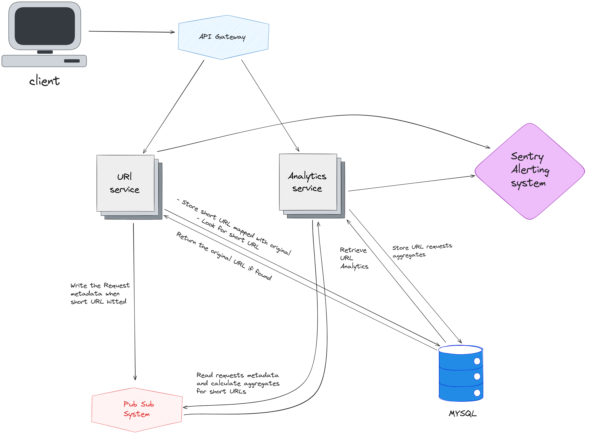

URL Shortener
---------------------

## Technologies & Language
- Golang
- Chi
- Mongo DB

## Use Cases
- User Send URL to be Shortened
- User hits a shortened URL
- User wants to see metrics for his url

## Constraints
*State Constraints*
- URL max length is 2048 Bytes 
- shortened URL should be less than or equal 75 bytes (average number for URL length)

# Design

# System Architecture
The system Consists of the following components
- API : Allow the users to interact with system (REST API)
- Back End : Receives the requests from the API for shortnening and redirecting 
- Database: Store the short url coupled with the original one, store url metrics (hits time and where it has been hit from) (NoSql)

## Design Core Components

#### Use Case: User sends a URL to be shortened
- The Client sends a Request to API with long URL to be shortened
- The server recevies the request and send the URL to backend
- Backend Shorten the URL and store the short URL coupled with original in the database
  - URL Shortener function:

    - Shorten the URL with MD5 or SHA1 algorithm
    - Check if the shortened URL collides with another in database but doesn't map to the same original URL
    - double hash the url or choose another algorithm for hashing
- The Server then Returns the shortened URL to the client

#### Use Case : User Hits a shortened URL
- The Client send a request to shortened URL
- The server receives the request and search the database for the original URL
- The database returns the original URL if it exisits 
- update the metrics of the url
- The server then redirect the client to original URL

#### Use Case : User wants to get metrics about URL 
The user might want to know metrics for his shortened url how many times it has been hit
timeline of hits rate and most country hit the URL.
- The client send request to get metrics for URL.
- The server recevies request and search database for url
- The database retrieve the url metrics
- The server returns the metrics to the client

#### Use Case: User want to get time series of URL hit rate
The user want to get the day with the highest hit rate on his url compared with the other days
starts from the day he stored his url until the day he requests to see metrics
- The client send request to get metrics for URL.
- The server receives request and search database for url
- the metrics are retrieved and calculated
- the server returns the metrics to the client

### Shortcoming
- Increase in the data URL time metrics as it increases when time passes

## Scale The Design

To Scale our Design improve the speed of redirecting and shortening we can add
Relational database (mysql) for faster reads and this will be used for store shortened url and redirections only
and the analytics will be handled by document database (Mongo)

